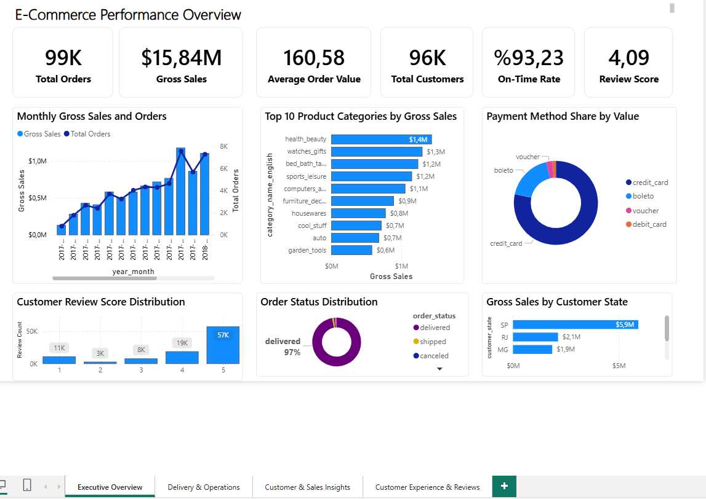
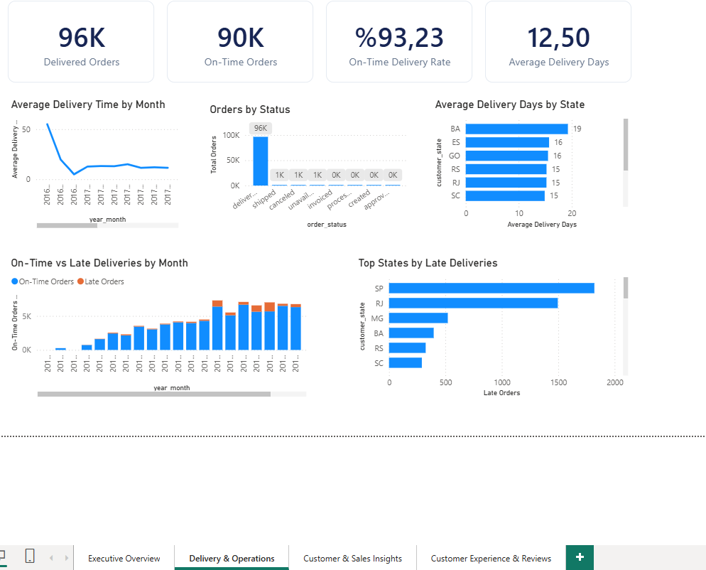
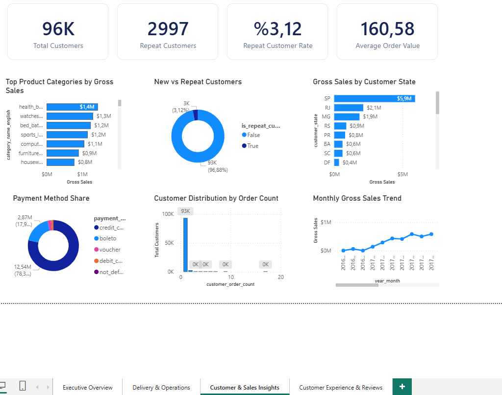
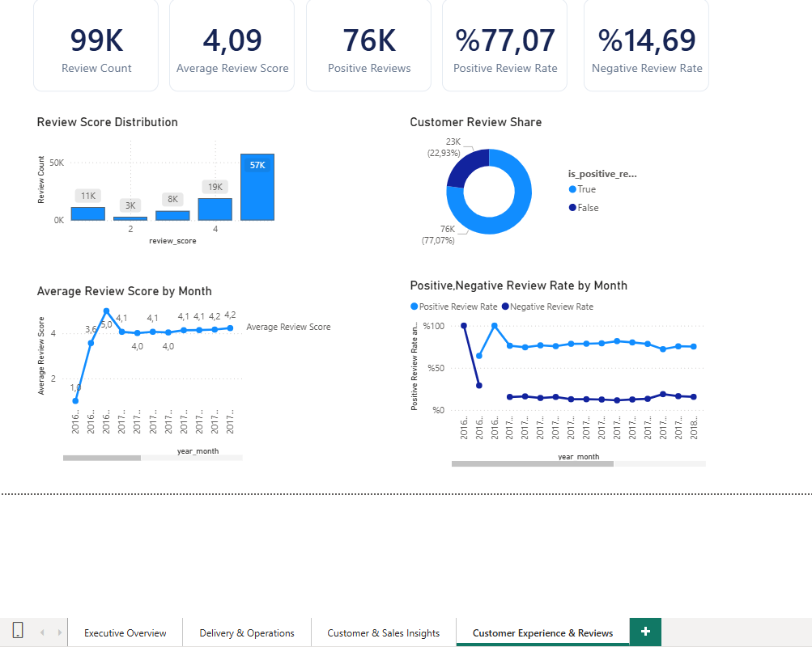

# E-Commerce Customer & Sales Analytics

An end-to-end SQL Server and Power BI portfolio project that turns Brazilian e-commerce transactions into a decision-focused view of commercial performance, delivery reliability, customer behavior and review quality.



## Project purpose

The goal is not only to show sales totals. The model connects revenue with the operational and customer signals that explain it: delivery speed, late-order concentration, repeat purchasing, geographic contribution, payment behavior and review sentiment.

The published repository contains reproducible SQL, DAX definitions, model documentation, report screenshots and the supplied anonymized order-payment CSV. The `.pbix` file and customer-identifying raw files remain excluded.

## Dashboard overview

The current report summarizes approximately 99K orders, 96K customers and $15.84M in captured payment value. These figures describe the supplied snapshot and can change if the source or filtering period changes.

### 1. Executive Overview

Answers: How is the marketplace performing overall, and where should management look next?

- KPIs: orders, gross sales, average order value, customers, on-time delivery and review score.
- Views: monthly sales/orders, leading categories, payment mix, review distribution, order status and sales by state.

### 2. Delivery & Operations



Answers: How reliably are orders delivered, how long do they take and where are delays concentrated?

- KPIs: delivered orders, on-time orders, on-time delivery rate and average delivery days.
- Views: monthly delivery time, status mix, delivery days by state, on-time versus late orders and late-order hotspots.

### 3. Customer & Sales Insights



Answers: Which customers, categories, states and payment methods drive value?

- KPIs: total customers, repeat customers, repeat rate and average order value.
- Views: category contribution, new versus repeat mix, sales by state, payment share, customer order-frequency distribution and monthly sales trend.

### 4. Customer Experience & Reviews



Answers: How do customers rate their experience, and is sentiment changing?

- KPIs: review count, average score, positive reviews, positive rate and negative rate.
- Views: score distribution, positive/negative share, monthly average score and monthly sentiment rates.

## Technical approach

```text
Raw CSV files -> SQL Server staging -> quality checks and reconciliation
              -> dimensional model -> Power BI semantic model -> four report pages
```

- SQL Server separates raw staging, analytics and reporting layers.
- The model uses conformed dimensions and separate order, item, payment and review facts.
- Financial reconciliation compares product + freight with payments at order grain.
- Power BI measures define business rules once and preserve filter context.
- Raw data and `.pbix` files are excluded to keep the repository lightweight and protect row-level data.

## Repository structure

```text
├── data/                # Included source files and data dictionary
├── dax/                 # Reusable Power BI measures
├── docs/                # Model, KPI and workflow documentation
├── screenshots/         # Final report pages
└── sql/                 # Ordered SQL Server pipeline and analysis queries
```

## Included data

`data/raw/order_payments/` contains all 103,886 supplied payment records in nine GitHub-friendly CSV parts. Every part repeats the same header, so Power BI can ingest them directly with the Folder connector. The combination of `order_id` and `payment_sequential` is unique across the complete dataset, and the five expected fields contain no missing values. See [data documentation](data/README.md) for the schema and validation summary.

The remaining source tables are not included yet. They can be added under `data/raw/` as they become available; the SQL source contract lists the complete expected set.

## Key metric rules

- Gross Sales = captured payment value, not an unsafe sum across joined item/payment rows.
- Average Order Value = Gross Sales / distinct orders.
- Total Customers uses the stable unique-customer identifier.
- On-Time Delivery Rate divides on-time delivered orders by delivered orders.
- Positive reviews are scores 4-5; negative reviews are scores 1-2.

See [metric definitions](docs/metric-definitions.md), [data model](docs/data-model.md), [project steps](docs/project-steps.md) and [DAX measures](dax/dax-measures.md) for the full implementation.

## How to reproduce

1. Create the SQL Server database and schemas with `sql/01-create-database-and-schemas.sql`.
2. Import the source CSV files into the expected staging tables.
3. Execute the remaining SQL files in the order listed in `sql/README.md`.
4. Connect Power BI to the analytics tables or reporting views.
5. Create the relationships documented in `docs/data-model.md`.
6. Add the measures from `dax/dax-measures.md` and recreate the report pages.

## Tools

Microsoft SQL Server, T-SQL, Power BI, Power Query and DAX.
